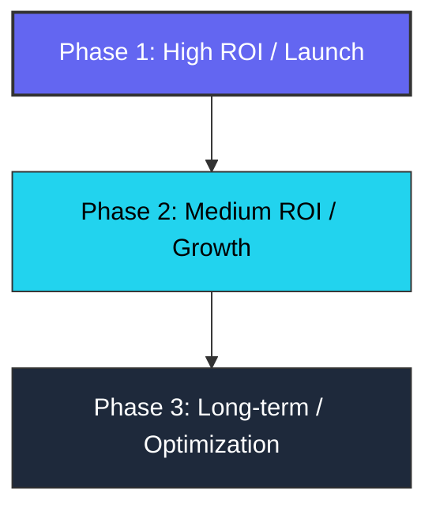

# Product Roadmap & Prioritization (ROI-Focused)

This document maps out the implementation strategy for the GST Toolkit based on ROI (effort vs. value).

---

## 1. Roadmap Overview

---

## 2. Priority 1: High ROI (Launch Prerequisites)

These tasks address immediate gaps relative to the planned feature set, fix inaccuracies, and ensure compliance.

### A. Dedicated Invoice Generator Page
*   **Objective**: Add a standalone page `/invoice-generator` to create GST-compliant business invoices.
*   **Features**:
    *   Form capturing Seller details (Name, Address, GSTIN), Buyer details (Name, Address, GSTIN), Invoice Date, and Number.
    *   Interactive item table using React Hook Form's `useFieldArray`.
    *   Real-time SGST/CGST/IGST breakdown and rounding.
    *   PDF download export via `html2canvas-pro` and `jspdf`.
*   **SEO Target Keyphrase**: "free online gst invoice generator india"
*   **ROI Estimation**: **High**. Crucial roadmap item, attracts high-value business users.

### B. FAQ Content & SEO Alignment
*   **Objective**: Update [page.tsx](file:///f:/Y.files/vsnexos/free-gst-calculator/src/app/gst-faq/page.tsx) to align the page title count ("50+ Questions") with actual content, or write additional questions.
*   **ROI Estimation**: **High**. Easy text modification, directly improves bounce rates and search authenticity.

---

## 3. Priority 2: Medium ROI (SEO & User Engagement)

These changes refine the architecture and establish a system to scale search content.

### A. Centralized Blog Engine & Route Migration
*   **Objective**: Transition from manually copying flat directories (like `/gst-freelancer-guide`) to a dynamic blog architecture under `/blog/[slug]`.
*   **Features**:
    *   Read article data from markdown/MDX files or a local article index.
    *   Provide an index list page at `/blog` with categories (Guides, Slabs, Compliance).
*   **ROI Estimation**: **Medium**. Moderately high effort, but greatly increases domain page count, internal linking depth, and organic keyword coverage.

### B. Shared Utility Dry Refactoring
*   **Objective**: Extract duplicate arithmetic operations from UI files into [gst-logic.ts](file:///f:/Y.files/vsnexos/free-gst-calculator/src/lib/gst-logic.ts).
*   **ROI Estimation**: **Medium**. Simplifies codebase, reducing future maintenance costs when changing tax formulas.

---

## 4. Priority 3: Low ROI / Long-Term Enhancements

Future expansions that can be deferred until the site has established stable organic traffic.

### A. Composition Tax Scheme Helper
*   **Objective**: Add a toggle or tab in the advanced calculator for composition taxpayers who pay a flat 1% or 5% tax.
*   **ROI Estimation**: **Low**. Niche audience segment, requires separate UI state.

### B. Automated Calculation & E2E Testing
*   **Objective**: Add Playwright integration tests and Jest unit tests for calculation edge cases (large numbers, precision rounding).
*   **ROI Estimation**: **Low**. High effort to set up pipeline, but guarantees long-term correctness as components evolve.
